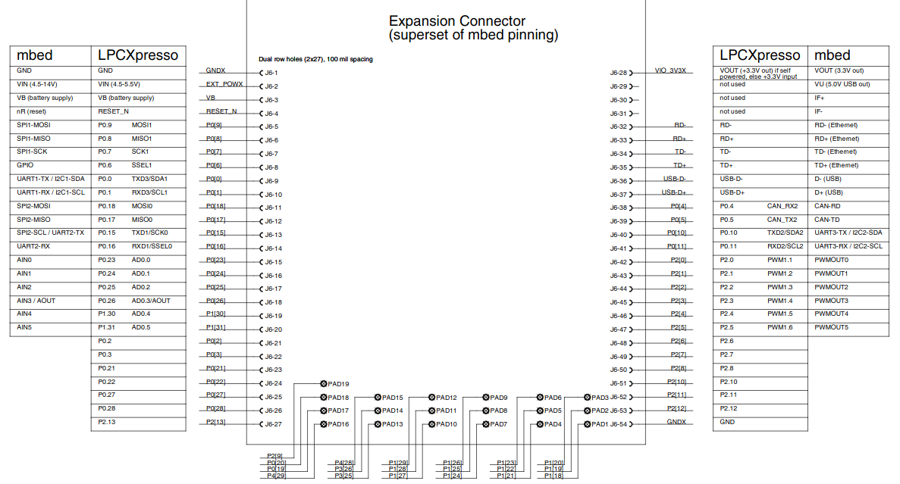
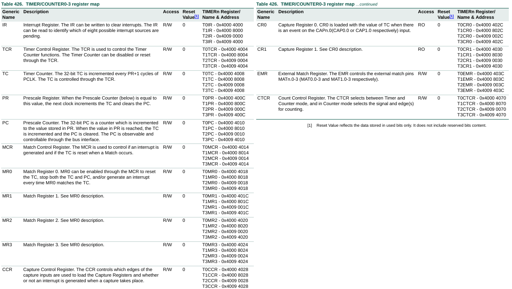
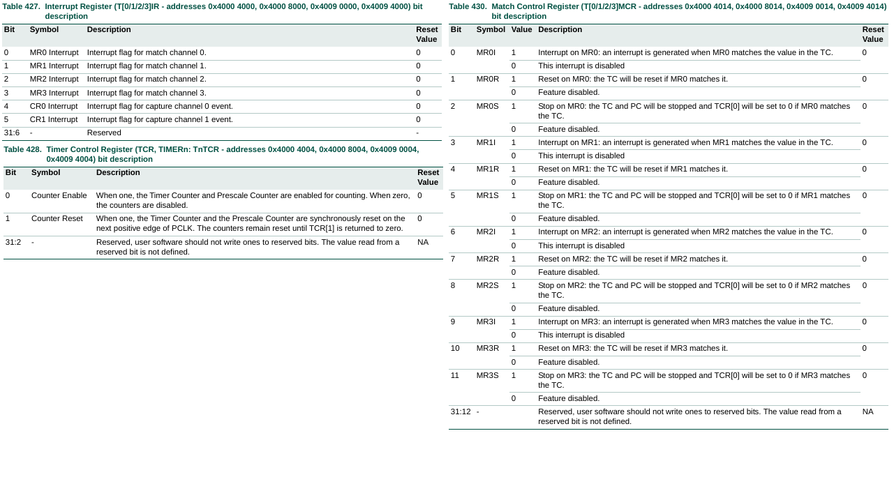
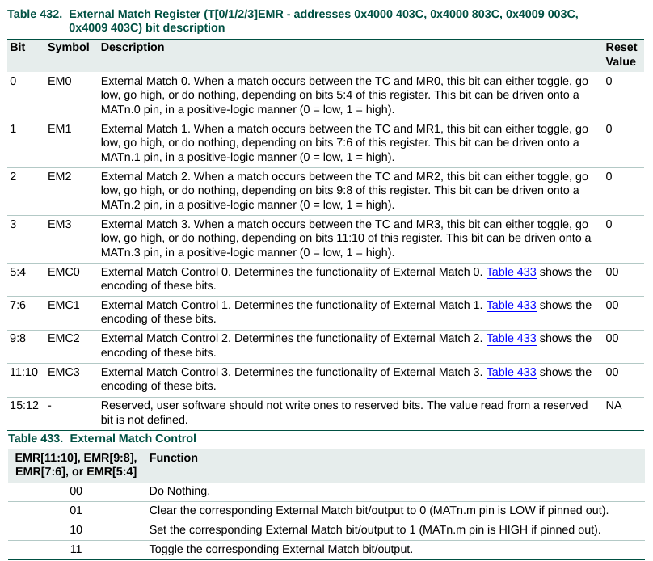
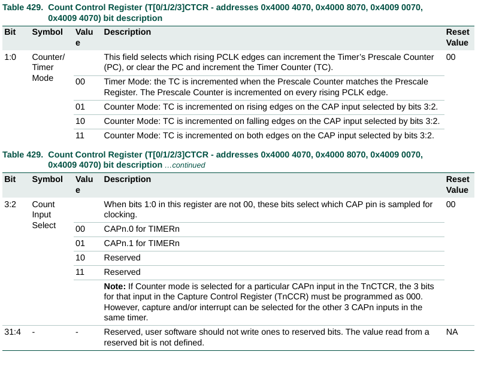
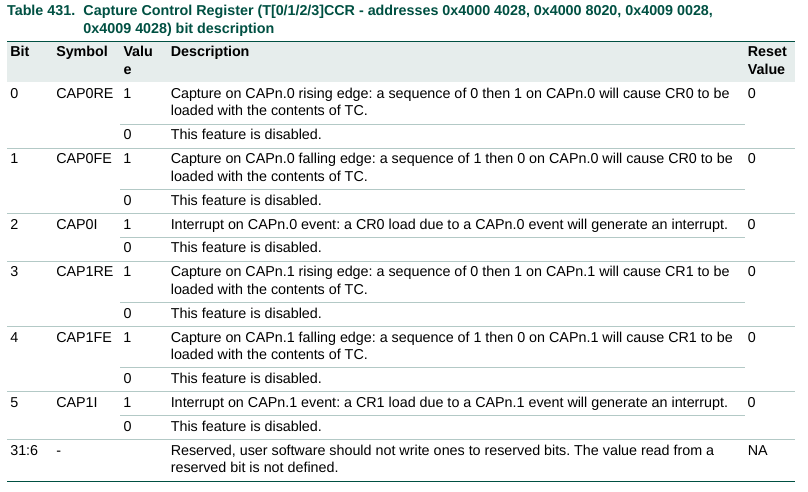

#   TIMERS lpc1769 Ejemplo
Proyecto ejemplo para controlar los timers periféricos incorporados al micro controlador LPCXpresso lpc1769.
El ejemplo hace alternar los estados de los LEDs embebidos en la placa LPCXpresso lpc1769.

- IDE: [MCUXpresso IDE](https://www.nxp.com/design/software/development-software/mcuxpresso-software-and-tools-/mcuxpresso-integrated-development-environment-ide:MCUXpresso-IDE).
- Lenguaje: C.
- Microcontrolador: [LPCXpresso lpc1769 rev C](https://www.embeddedartists.com/products/lpc1769-lpcxpresso/).

---
## LPCXpresso LPC1769
 

### PCONP

### PCLKSELx

### ISER0

### TIMERx - REGISTROS

---
Espero le sea de útilidad.

Aportes y sugerencias siempre serán bienvenidas.

Autor: @ealegremendoza

E-mail: ealegremendoza@gmail.com
